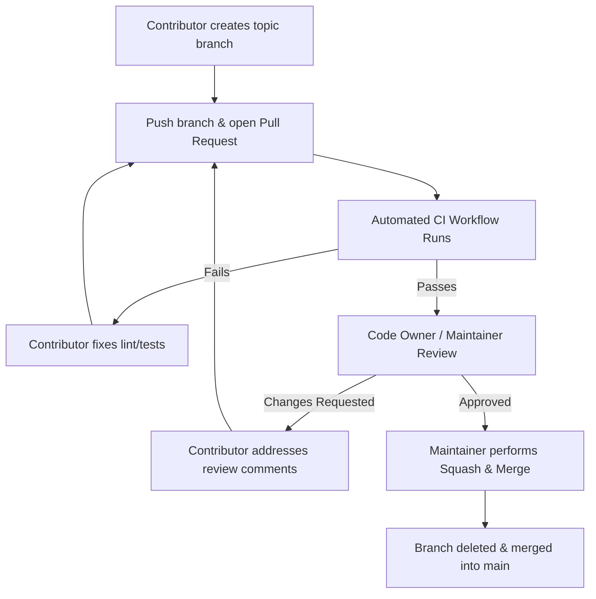

# Branch Protection & Review Process Guide 🛡️

This document details the Branch Protection rules and pull request review policies for the `CompanyOS` repository. It provides exact instructions for repository administrators on configuring GitHub branch rules via the UI or `gh` CLI.

---

## 🎯 Objectives

- **Prevent Unreviewed Code**: Ensure all changes entering `main` are reviewed by at least one maintainer.
- **Automated Verification**: Mandate that continuous integration (CI) tests, lint checks, and type checks pass before merging.
- **Linear History**: Require squash-and-merge or linear rebase history to keep `git log` clean and readable.
- **Security & Integrity**: Disallow force pushes, disallow branch deletions, and enforce signed commits (recommended).

---

## 🔒 Recommended Rule Configuration (`main` branch)

| Rule Setting | Recommended Value | Description |
| :--- | :--- | :--- |
| **Branch Pattern** | `main` | Protects the production primary branch |
| **Require Pull Request before merging** | ✅ Enabled | Disallows direct pushes to `main` |
| **Required Approving Reviews** | `1` (or `2` for major releases) | Requires at least 1 approving maintainer review |
| **Dismiss stale PR approvals on new commits** | ✅ Enabled | Re-triggers review if new commits are added |
| **Require review from Code Owners** | ✅ Enabled | Routes PRs to owners defined in `.github/CODEOWNERS` |
| **Require Status Checks to Pass** | ✅ Enabled | Mandates CI job completion before merge |
| **Status Checks Required** | `ci / lint-and-test` | Must pass Python tests & Next.js linting |
| **Require Branches to be Up-to-Date** | ✅ Enabled | Ensures code is tested against latest `main` |
| **Require Signed Commits** | ✅ Recommended | Ensures GPG/SSH commit signature validity |
| **Require Linear History** | ✅ Enabled | Restricts merge style to Squash or Rebase |
| **Do not allow bypassing settings** | ✅ Enabled | Applies rules to administrators as well |
| **Allow Force Pushes** | ❌ Disabled | Prevents destructive history rewrites |
| **Allow Deletions** | ❌ Disabled | Prevents accidental branch deletion |

---

## 🛠️ Step-by-Step UI Configuration Instructions

1. Open the repository on GitHub: `https://github.com/theunrealfusion/CompanyOS`.
2. Click on **Settings** -> **Branches**.
3. Under **Branch protection rules**, click **Add branch ruleset** (or **Add rule**).
4. In **Branch name pattern**, enter `main`.
5. Check the following options:
   - [x] **Require a pull request before merging**
     - [x] Require approvals: `1`
     - [x] Dismiss stale pull request approvals when new commits are pushed
     - [x] Require review from Code Owners
   - [x] **Require status checks to pass before merging**
     - Search and select: `ci / lint-and-test`
     - [x] Require branches to be up to date before merging
   - [x] **Require linear history**
   - [x] **Do not allow bypassing the above settings**
6. Click **Save changes**.

---

## 💻 Automated Configuration via GitHub CLI (`gh`)

Repository administrators with admin tokens can execute the following `gh` CLI command to configure branch protection instantly:

```bash
gh api \
  --method PUT \
  -H "Accept: application/vnd.github+json" \
  /repos/theunrealfusion/CompanyOS/branches/main/protection \
  -f required_status_checks='{"strict":true,"contexts":["ci / lint-and-test"]}' \
  -f enforce_admins=true \
  -f required_pull_request_reviews='{"dismiss_stale_reviews":true,"require_code_owner_reviews":true,"required_approving_review_count":1}' \
  -f restrictions=null \
  -f required_linear_history=true \
  -f allow_force_pushes=false \
  -f allow_deletions=false
```

---

## 🔀 Pull Request Review Process Workflow



1. **Submission**: Contributor pushes a topic branch (`feat/*`, `fix/*`) and opens a PR against `main`.
2. **Automated Checks**: GitHub Actions triggers `.github/workflows/ci.yml`.
3. **Peer Review**: Code Owners receive a review request. Maintainers verify code structure, tests, and adherence to architecture.
4. **Merge**: Upon approval and passing checks, the PR is merged via Squash & Merge into `main`.
